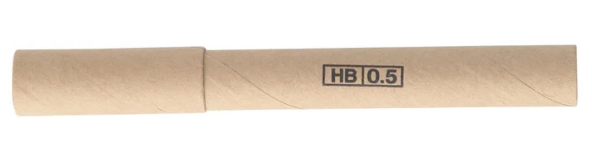

# IO Family Knowledge Base

## 接下来要写的

- [ ] 理发
- [ ] 仅提供场地
- [ ] 硬要多加
- [ ] 活动桌面恢复
- [ ] 玩游戏玩到一半
- [ ] 苏醒
- [ ] 床底下的音响
- [ ] 电灯泡 bzzz
- [ ] 湿 vs 干
- [ ] KTPC

## 画画有害身体健康

> **Drawing is bad for your health. **

启帆名言，IO Family 可追溯最早的内容。

## 关在里面15天，一打开，逃走了

王喆

> 小学时书桌上有一个空的自动笔芯纸筒。看见有个虫爬过，我把虫抓了关在纸筒里，然后就忘了。后来大约过了15天打开纸筒，虫子逃走了。

230-1时期可形容至翰

> 把至翰放在安全模式的230-1里15天，一开门，逃走了。

## 安全模式

最初指视窗个人微机的安全模式：桌面黑色背景，四个角落里有“安全模式”字样。

此后亦指三星数字移动电话机的安全模式：桌面布局全乱，左下角常亮“安全模式”字样。启帆非常怕输（烧屏），而王喆认为三星做为大厂已经针对此情况做出防烧屏机制。

也有可能是更广义抽象的概念：一个没有家具的230-1，打开门黑乎乎的。房间的角落里写有“安全模式”。

王喆：夏天搬家没有家具只好在安全模式的公寓里睡一个星期的地板，没有窗帘阳光直射又热又痛。因此总结“安全模式有害健康”。后来萧氏通信上门安装了宽带，升级为“带网络连接的安全模式”。

## 核心刷牙、独立刷牙

核心刷牙：洗澡的时候刷牙，代表人物：王喆。

独立刷牙：在洗脸台前刷牙，代表人物：启帆。

核心刷牙迎来日落：2023年末王喆升级电动牙刷，此后无法核心刷牙。

## 你甚至可以拍到星星

**Even you can shot the stars. **

源自谷歌像素广告，后指4700 Epworth Circle, Niagara Falls, ON L2E 1C6 男生宿舍浴室的灯。

## 笑

王喆半夜从227-2跑到230-1和启帆笑。

“启帆亦未寝，笑。”

## 微软反馈

原指视窗10及以上操作系统，按视窗徽标键与F打开反馈集。

后指启帆的表面大师上为王喆提供的日记应用。“我教你画马”。

## 卡G门

源自王喆的OneNote错误的OCR手写识别并显示在显眼的地方。

现表示各种类型的卡住(Struggle)。

因谷歌说“G is for Google”，所以卡G门更适合用于形容在谷歌的成品中遇到困难。例如：产品下架。

已经发生的卡G门事件：谷歌相册（Google Photos）停止提供无限空间、Stadia停止服务、谷歌域名（Google Domains）停止服务、谷歌酱板（Google Jam Board）即将停止服务。

## 静电

Static，指存储在内容分发网络（CDN）中的静态内容。启发自谷歌静电（gstatic.com）。

## 开走了

Drive away，原指公司或家庭共享的OneDrive被终止共享导致文件丢失。现亦指云服务停止工作造成的损失。

## LUCK

王喆

- 第一把考官乱点输
- 第二把考官乱点输
- 第三把直线行驶输
- 第四把直线行驶输
- 第五把公交站台输
- 第六把没输

至翰

> 学车呢，你有一定概率接触到“纳可谷歌”并成为传统或者智慧学员。
> 等到正式考试的时候呢，“谷歌”会逃走让“纳可谷歌”变成“纳可”。
> 注意哈，“纳可”不是NAKE而是LUCK，全称Linear Unsuccessfully Car Keeping，翻译过来就是“等待监管系统回应。方向控制不稳，无法保持车辆直线运动状态。扣100分，成绩不合格。”
> 等你考试通过拿证了呢，也不要急着把“纳可”删掉，到时候它会变成License Under Correct Knowledge，意思是你不能去点首页上的“确认退学”。

## 媒体开始重复

王喆在观看媒体时突然发现媒体开始重复，但是他没意识到他正在观看纳可谷歌记录。

## 至翰怕

至翰怕狗、猫、洋葱、咖啡、冰粉、整个大蒜、地铁、酸黄瓜。

合理运用Exposure Therapy或许可缓解Psychological Allergies。

`pip install therapy`

亦可尝试三个O的经典汉堡

## 安检、骨头

王喆因为路上找不到垃圾桶，差点把肯德基垃圾带上地铁。
